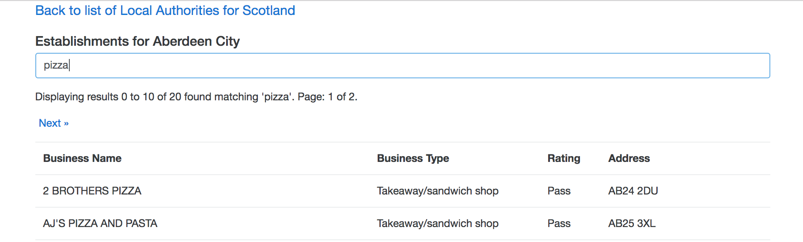
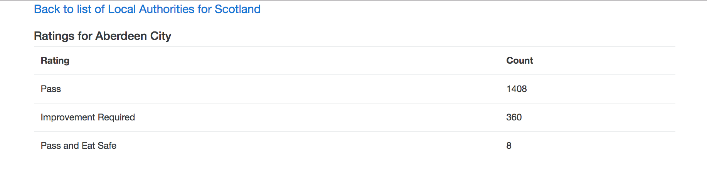

# ReactReduxFoodHygieneSearch

An application that displays a summary of Food Hygiene Ratings across a selected Local Authority and also 
the option to search for Ratings at specific Establishments. 

Uses data published by the [UK Food Standards Agency API](http://ratings.food.gov.uk/open-data/en-GB). 


## Screenshots

- Select a Region


- Select a Local Authority for a Region


- Show a Ratings Summary of Establishments in a Local Authority


- Search for Establishments in a Local Authority



## Getting Started

The following assumes that `npm` is installed. Checkout this repo, install dependencies, 
then start the webpack process with the following:

```
> git clone https://github.com/chrishodgson/ReactReduxFoodHygieneSearch.git
> cd ReactReduxFoodHygieneSearch
> npm install
> npm start
```
