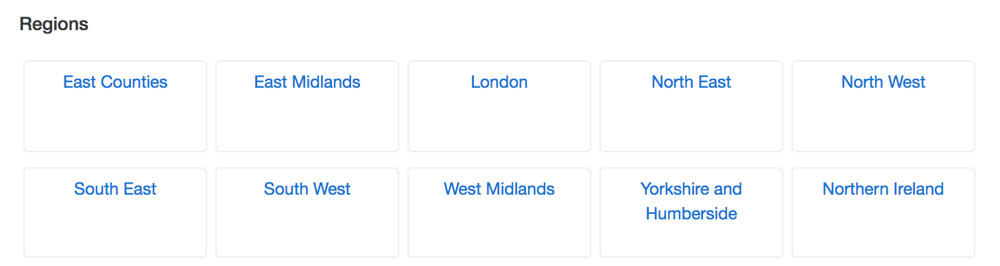
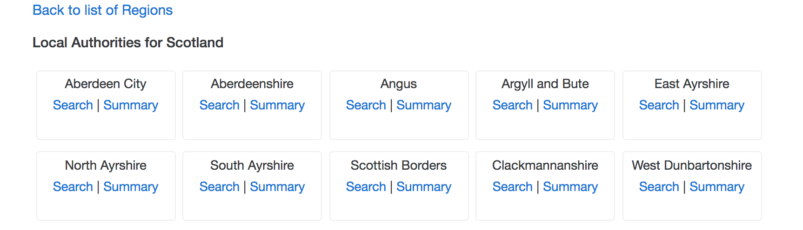

# ReactReduxFoodHygieneSearch

An application that displays a summary of Food Hygiene Ratings across a selected Local Authority and also 
the option to search for Ratings at specific Establishments. 
Uses [Food Hygiene Ratings Open Data](http://ratings.food.gov.uk/open-data/en-GB) 
published via an API by the UK Food Standards Agency. 


## Screenshots

### 1. Select a Region


### 2. Select a Local Authority for the Region


### 3. Show a Ratings Summary for Establishments across the Local Authority


### 4. Search Establishments across the Local Authority


## Getting Started

The following assumes that `npm` is installed. Checkout this repo, install dependencies, 
then start the webpack process with the following:

```
> git clone https://github.com/chrishodgson/ReactReduxFoodHygieneSearch.git
> cd ReactReduxFoodHygieneSearch
> npm install
> npm start
```
